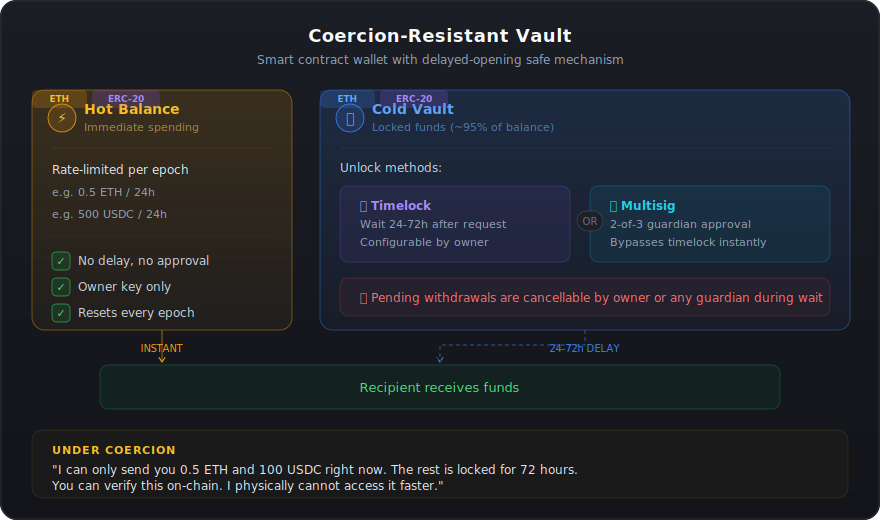

# ERC: Coercion-Resistant Vault Standard

> Protecting crypto holders from physical coercion attacks ("$5 wrench attacks") through smart contract-enforced spending limits, timelocks, and multisig.

## The problem

Physical attacks against cryptocurrency holders increased **169% in 2025**, with over 70 confirmed cases worldwide. Attackers break into victims' homes and force them to hand over private keys, draining entire wallets in minutes with no possibility of reversal.

Current self-custody wallets have a fundamental design flaw: **whoever controls the private key gets immediate, unrestricted access to the entire balance**. This makes crypto holders uniquely attractive targets for violent crime compared to traditional finance, where bank vaults have delayed openings and wire transfers can be reversed.

## The solution

A smart contract wallet standard that works like a **bank vault with delayed opening**:

  

### Why this beats existing approaches

| Approach | Problem | Our solution |
|---|---|---|
| **Duress/decoy wallet** | Attacker may know about it and escalate violence | Constraint is on-chain and verifiable — no deception needed |
| **Pure multisig** | Friction for daily use, cosigners must be available | Hot balance for daily spending, multisig only for cold vault |
| **Pure timelock** | Can't spend anything immediately | Rate-limited hot balance works instantly |
| **Hardware wallet** | Still gives full access under physical coercion | Smart contract enforces limits regardless of key holder |

## Features

- **ETH + ERC-20 support** — Independent spending limits per asset (ETH, USDC, WBTC, etc.)
- **Rate-limited hot balance** — Spend up to a configurable limit per epoch, no manual refilling
- **Timelocked cold vault** — Bulk of funds locked behind 24-72h delay
- **Multisig bypass** — Guardians can approve instant withdrawal when legitimately needed
- **Cancellable withdrawals** — Owner or any guardian can cancel during timelock window
- **Timelocked configuration** — Attackers can't force limit increases or timelock reductions
- **Tokens safe by default** — New tokens deposited have zero hot budget until configured
- **DeFi execution** — Interact with whitelisted protocols (swaps, LP, etc.) without leaving the vault
- **Whitelisted targets** — Only timelocked-approved contracts can be called via `execute()`
- **ERC-4337 smart account** — Works as a native smart account with any dApp (Uniswap, Aave, etc.) via compatible wallets

## Repository contents

| File | Description |
|---|---|
| [`ERC-coercion-resistant-vault.md`](./ERC-coercion-resistant-vault.md) | Full ERC proposal draft following EIP-1 template |
| [`CoercionResistantVault.sol`](./CoercionResistantVault.sol) | Reference implementation in Solidity 0.8.20 (ETH + ERC-20) |

## Architecture

The standard defines three interfaces plus ERC-4337 account abstraction:

- **`ICoercionResistantVault`** (core) — ETH hot/cold balance, timelocks, guardians, multisig
- **`ICoercionResistantVaultTokens`** (extension) — ERC-20 token deposits, per-token spending limits, token cold vault withdrawals
- **`ICoercionResistantVaultExecutor`** (extension) — DeFi execution via whitelisted targets, `approveToken()`, batch operations, timelock-managed whitelist
- **`IAccount`** (ERC-4337) — Smart account support via `validateUserOp()`, ECDSA signature validation, EntryPoint integration

All share the same timelock duration, guardian set, and multisig configuration. The separation allows simpler implementations to adopt only the interfaces they need.

## Key design decisions

### Independent spending limits per token

Different assets have different values and use patterns. A user might configure 500 USDC/day for expenses while keeping WBTC at 0.005/day. Tokens start with zero hot budget by default — they sit entirely in the cold vault until a limit is configured.

### Shared timelock across all assets

The timelock is a security parameter, not an asset-management one. Per-token timelocks would let an attacker search for the token with the shortest delay. One shared timelock ensures consistent protection.

### Configuration changes are also timelocked

An attacker cannot force the victim to raise the spending limit and drain immediately — limit increases (ETH or any token) are themselves subject to the timelock delay. Only security-*increasing* changes (lowering limits, extending timelocks) take effect immediately.

### Guardians can cancel pending withdrawals

If an attacker initiates a cold vault withdrawal and leaves, any guardian can cancel it during the timelock window. This is the "panic button" that makes the timelock actually useful.

### Rate-limited, not pooled

The hot balance is not a separate pool that needs manual refilling — it's a rate limit on the total balance. The user always has access to their daily budget without any action.

### DeFi execution with whitelisted targets

The vault can act as a smart account, interacting with DeFi protocols (Uniswap, Aave, etc.) via `execute()` and `executeBatch()`. Only contracts on a **timelock-managed whitelist** can be called. Adding a new target requires waiting the full timelock (e.g., 72h), so an attacker cannot force the victim to whitelist a malicious contract and drain immediately. Removing targets is instant. DeFi calls are **not subject to spending limits** because swaps and LP are value-preserving — the vault retains custody of the resulting assets.

Token allowances are granted via a dedicated `approveToken(token, spender, amount)` where the spender must be whitelisted. Token contracts themselves are never whitelisted (otherwise `execute()` could call `transfer()` and bypass spending limits).

### ERC-4337: works with any dApp

The vault implements `IAccount` (ERC-4337 v0.7), making it a native smart account. The user experience:

1. Connect the **vault address** to Uniswap (not the owner EOA)
2. Uniswap builds a swap transaction — the wallet wraps it as a UserOperation
3. The owner signs with their EOA key, a bundler submits to the EntryPoint
4. EntryPoint validates the signature via `validateUserOp()` and executes

All vault security rules (spending limits, timelocks, whitelist) apply identically whether the call comes directly from the owner or through the EntryPoint. The owner's EOA key is the "remote control" — it can sign UserOperations but holds no funds.

## Recommended configurations

### ETH

| Profile | Spending limit | Timelock | Multisig |
|---|---|---|---|
| Long-term holder | 0.1 ETH / 24h | 72 hours | 2-of-3 |
| Active user | 1 ETH / 24h | 48 hours | 2-of-3 |
| Frequent trader | 5 ETH / 24h | 24 hours | 3-of-5 |

### ERC-20 Tokens (example for active user profile)

| Token | Spending limit / 24h | Rationale |
|---|---|---|
| USDC | 500 | Daily expenses |
| USDT | 500 | Daily expenses |
| DAI | 500 | Daily expenses |
| WETH | 0.5 | Tight limit on high-value |
| WBTC | 0.01 | Very restricted |
| Others | Not configured | 100% cold vault |

> **Aggregate exposure note:** The sum of all per-token hot budgets is the maximum an attacker can extract in one epoch. 10 tokens × $1,000/day each = $10,000 total immediate exposure.

## Roadmap

1. **✅ Pre-draft** — ERC document and reference implementation (this repo)
2. **⬜ Community feedback** — Publish on [Ethereum Magicians](https://ethereum-magicians.org)
3. **⬜ Formal submission** — PR to [ethereum/EIPs](https://github.com/ethereum/EIPs)
4. **⬜ Testing** — Foundry test suite + testnet deployment
5. **⬜ Audit** — Security review by recognized firm
6. **⬜ Adoption** — Integration with wallet providers (Safe, MetaMask, etc.)

## Contributing

This is a pre-draft proposal. Feedback, issues, and PRs are welcome.

If you've been affected by a physical attack or know someone who has, this standard is being built for you. Every improvement to the threat model helps.

## Author

- [@cmayorga](https://github.com/cmayorga) — [DeFiRe](https://github.com/DeFiRe-business)

## License

This work is released under [CC0 1.0 Universal](./LICENSE), the same license used by all Ethereum EIPs.
